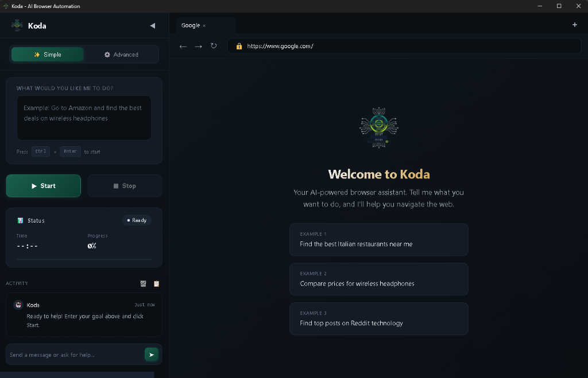

<!--
Koda - Intelligent Browser Automation Library
This project uses Koda by Trent Pierce
https://github.com/TrentPierce/Koda
Licensed under the Koda Non-Commercial License

Copyright (c) 2026 Trent Pierce. All rights reserved.
See LICENSE file for full terms.
-->

<p align="center">
  
</p>

# Koda 🤖

### AI-Powered Browser Automation



[](https://github.com/TrentPierce/Koda/actions)
[](LICENSE)
[](https://deepwiki.com/TrentPierce/Koda)

**Koda** is an intelligent autonomous agent for the web. Unlike traditional scrapers that break easily, Koda uses **Computer Vision** and **Multi-LLM Intelligence** to understand and interact with any web application — just like a human user.

> ⚠️ **Public Beta**: Koda is in active development. Report issues at [GitHub Issues](https://github.com/TrentPierce/Koda/issues).

---

## ✨ Why Koda?

- **🧠 Smart Understanding**: Uses AI (Gemini, OpenAI, Claude) to understand web pages naturally
- **🔄 Self-Healing**: Adapts when sites change — no more broken selectors
- **🌐 Multi-Browser**: Works with Chrome, Firefox, Safari, Edge
- **📱 Mobile Ready**: Automate iOS and Android apps with the same code
- **🎯 Stagehand Compatible**: Drop-in replacement with familiar API
- **⚡ Easy to Use**: Simple JavaScript API for complex tasks

---


## 🛡️ Security & CI Hardening Updates (Feb 2026)

Recent improvements now live in the codebase:

- REST API now includes built-in request rate limiting and safer default host binding (`127.0.0.1` by default).
- Tool hardening:
  - `APITool` blocks private/local network targets by default and supports explicit host allowlists.
  - `FileTool` enforces stronger path-boundary checks and rejects symlink targets.
- Packaging reliability:
  - npm tarballs now include required root-level runtime modules used by the public entrypoint.
- Release/CI reliability:
  - `test`, `lint`, and `build` scripts no longer swallow failures.
  - GitHub workflows use `npm ci --omit=optional --legacy-peer-deps` for cleaner deterministic installs.

See detailed audit and roadmap in `docs/reports/PROJECT_AUDIT_RECOMMENDATIONS.md`.

---

## 🚀 Quick Start

### Installation

```bash
npm install @trentpierce/koda
```

### Basic Usage

```javascript
const { createAgent } = require('@trentpierce/koda');

async function main() {
    const agent = await createAgent({
        provider: 'gemini',      // or 'openai', 'anthropic'
        apiKey: process.env.GEMINI_API_KEY,
        headless: false
    });

    // Navigate and interact naturally
    await agent.goto('https://example.com');
    await agent.act('Click the login button');
    await agent.type('#username', 'myuser');
    await agent.type('#password', 'mypass');
    await agent.act('Click submit');

    // Extract information
    const data = await agent.extract('Get all product prices');
    console.log(data);

    await agent.close();
}

main().catch(console.error);
```

That's it! Koda handles the rest — finding elements, handling dynamic content, adapting to changes.

---

## 📦 Installation

### Requirements
- Node.js 18+
- An LLM API key (Gemini, OpenAI, or Anthropic)

### Full Install (Optional Features)

```bash
# Core library
npm install @trentpierce/koda

# Optional: Puppeteer (recommended)
npm install puppeteer

# Optional: Mobile automation
npm install webdriverio
npm install -g appium

# Optional: Computer vision
npm install sharp opencv4nodejs

# Optional: LLM SDKs
npm install openai @anthropic-ai/sdk
```

---

## 🎯 Key Features

### AI-Powered Automation
- **Multi-LLM Support**: Switch between Gemini, OpenAI, and Claude
- **Visual Understanding**: Sees the page like a human, not just the DOM
- **Natural Language Commands**: Describe what you want, Koda figures out how

### Self-Healing Selectors
Automatically adapts when sites change:
- Falls back to alternative selectors when primary ones fail
- Uses visual matching when selectors aren't available
- Reduces maintenance and debugging time

### Multi-Browser & Mobile
- **Web**: Chrome, Firefox, Safari, Edge
- **Mobile**: iOS and Android apps with Appium
- Same code works everywhere

### Advanced Capabilities
- **Session Management**: Persistent authentication across runs
- **Network Interception**: Mock APIs and intercept requests
- **Computer Vision**: OCR, object detection, visual element finding
- **Reinforcement Learning**: Improve over time with experience

---

## 💡 Usage Examples

### Self-Healing Selectors

```javascript
const { SelfHealingSelector } = require('@trentpierce/koda');

const selector = new SelfHealingSelector({
    enableHealing: true,
    maxHealingAttempts: 5
});

// If #login-btn fails, automatically tries:
// [data-testid="login"], [aria-label="Login"], button:has-text("Login"), etc.
const element = await selector.findWithHealing(page, '#login-btn');
```

### Mobile Automation

```javascript
const { MobileAgent } = require('@trentpierce/koda/mobile');

const agent = new MobileAgent({
    platform: 'android',
    deviceName: 'Pixel_6_API_33',
    appPackage: 'com.example.app'
});

await agent.initialize();

// Same natural language commands as web
await agent.tap('Login');
await agent.type('#username', 'testuser');
await agent.swipe({ direction: 'up' });
```

### Network Interception

```javascript
const { NetworkInterceptor } = require('@trentpierce/koda');

const interceptor = new NetworkInterceptor();
await interceptor.init(page);

// Mock API responses
interceptor.mock('**/api/users', {
    status: 200,
    body: [{ id: 1, name: 'Mock User' }]
});

// Modify requests
interceptor.route('**/*', (request) => {
    if (request.url().includes('api')) {
        request.continue({
            headers: { ...request.headers(), 'X-Custom-Header': 'value' }
        });
    } else {
        request.continue();
    }
});
```

### Session Persistence

```javascript
const { SessionManager } = require('@trentpierce/koda');

const sessions = new SessionManager({ storagePath: './sessions' });

// Capture state after login
await sessions.captureState(page, 'user-session');

// Restore later without re-login
await sessions.restoreState(page, 'user-session');
```

### Custom Tools

```javascript
const { createAgent } = require('@trentpierce/koda');

const agent = await createAgent({ ... });

// Register custom tool
agent.registerTool('myTool', async (params) => {
    return { success: true, data: params };
}, {
    name: 'myTool',
    description: 'My custom tool',
    parameters: {
        type: 'object',
        properties: { key: { type: 'string' } }
    }
});

// Use it
const result = await agent.useTool('myTool', { key: 'value' });
```

---

## 🔧 Environment Variables

Create a `.env` file:

```env
# Required: Choose at least one LLM provider
GEMINI_API_KEY=your_gemini_key
OPENAI_API_KEY=your_openai_key
ANTHROPIC_API_KEY=your_anthropic_key

# Optional
GEMINI_MODEL=gemini-1.5-flash
OPENAI_MODEL=gpt-4
ANTHROPIC_MODEL=claude-3-opus-20240229
```

---

## 📚 Documentation

- **[Quick Start Guide](QUICKSTART.md)** - All installation and setup options
- **[Mobile Automation](docs/MOBILE_AUTOMATION.md)** - iOS and Android automation
- **[Reinforcement Learning](docs/REINFORCEMENT_LEARNING.md)** - RL algorithms and usage
- **[Contributing](CONTRIBUTING.md)** - How to contribute
- **[API Reference](docs/API_REFERENCE.md)** - Complete API documentation

---

## 🏗️ Deployment Modes

### Library Mode (Recommended)
Import as a JavaScript module. Perfect for:
- Integration into existing projects
- CI/CD pipelines
- Node.js applications

### Standalone Mode (Electron)
Desktop application with UI. Good for:
- Manual testing and debugging
- Visual workflow creation
- Password-protected memory

### Server Mode (Docker/API)
Run as a service. Ideal for:
- Cloud deployment
- Multi-user access
- API-driven automation

```bash
# Run as server
npm run server

# Run standalone (Electron)
npm start
```

---

## 🧪 Testing

```bash
# Run tests
npm test

# Run with coverage
npm run test:coverage

# Lint
npm run lint
```

---

## 📊 Status

- **Version**: 2.2.0
- **License**: Non-Commercial with Attribution
- **CI/CD**: GitHub Actions
- **Test Coverage**: Comprehensive
- **Browsers**: Chrome, Firefox, Safari, Edge
- **Mobile**: iOS, Android (Appium)

---

## 📄 License

**Koda Non-Commercial License with Attribution**

### ✅ You CAN:
- Use for personal projects
- Use for educational purposes
- Use in non-profit organizations
- Create open-source derivatives
- Contribute improvements back

### 📢 You MUST:
- Provide attribution to Trent Pierce in source code, documentation, and UI
- Include the license file when distributing
- State any changes you make

### ❌ You CANNOT:
- Use for commercial purposes without a separate license
- Sell this software or derivatives
- Use in business operations for profit
- Remove attribution

See [LICENSE](LICENSE) for full terms.

**Commercial licensing available** - Contact [Trent Pierce](https://github.com/TrentPierce) for inquiries.

---

## 🤝 Contributing

Contributions welcome! Please:
1. Fork the repository
2. Create a feature branch
3. Make your changes
4. Submit a pull request

See [CONTRIBUTING.md](CONTRIBUTING.md) for guidelines.

---

## 🔗 Links

- **GitHub**: https://github.com/TrentPierce/Koda
- **Issues**: https://github.com/TrentPierce/Koda/issues
- **Community**: Join the discussion

---

Built with intelligence, designed for scale.
